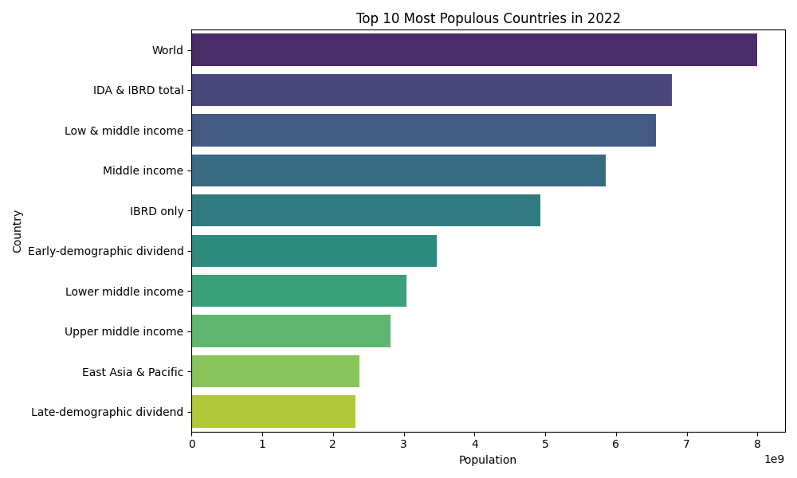

# Data Science Task 01: Population Distribution Bar Plot

## Overview
In this project, I created a bar plot to visualize the distribution of the most populous countries based on the latest data from the World Bank for the year 2022. The analysis uses the World Bank's dataset on total population by country, which is processed to generate a plot of the top 10 most populous countries.

The dataset used in this project is publicly available from the World Bank:

- Dataset: [World Bank Population Data](https://data.worldbank.org/indicator/SP.POP.TOTL)

## Objective
The objective of this project is to:
- Load the population data from the World Bank's dataset.
- Clean and process the data.
- Generate a bar plot to show the distribution of the top 10 most populous countries in the year 2022.

## Steps to Execute
1. **Clone the Repository**:  
   Clone this repository to your local machine using the following command:
   ```bash
   git clone https://github.com/your-username/PRODIGY_DS_01.git
   ```

2. **Install Dependencies**:  
   Install the required Python libraries using `pip`. You can install them from the `requirements.txt` file:
   ```bash
   pip install -r requirements.txt
   ```

3. **Run the Script**:  
   Run the Python script to generate the bar plot:
   ```bash
   python population_chart.py
   ```

4. **Output**:  
   After running the script, the `population_barplot_2022.png` image will be saved in the `Images/` directory.

## Visualizations

Below is the bar plot visualization of the top 10 most populous countries in the year 2022:



## Explanation of the Code
The Python script (`population_chart.py`) performs the following steps:
1. **Data Loading**: The script loads the population data from a CSV file downloaded from the World Bank.
2. **Data Processing**: It extracts the relevant column for the year 2022 and sorts the countries by their population in descending order.
3. **Plotting**: The script uses `matplotlib` and `seaborn` to create a bar plot of the top 10 most populous countries in 2022.

## Technologies Used
- Python
- Pandas
- Matplotlib
- Seaborn

## File Structure
```
PRODIGY_DS_01/
├── population_chart.py      # Python script for generating the bar plot
├── requirements.txt         # Python dependencies
├── Images/
│   └── population_barplot_2022.png  # Saved bar plot image
├── README.md                # Project documentation
```

